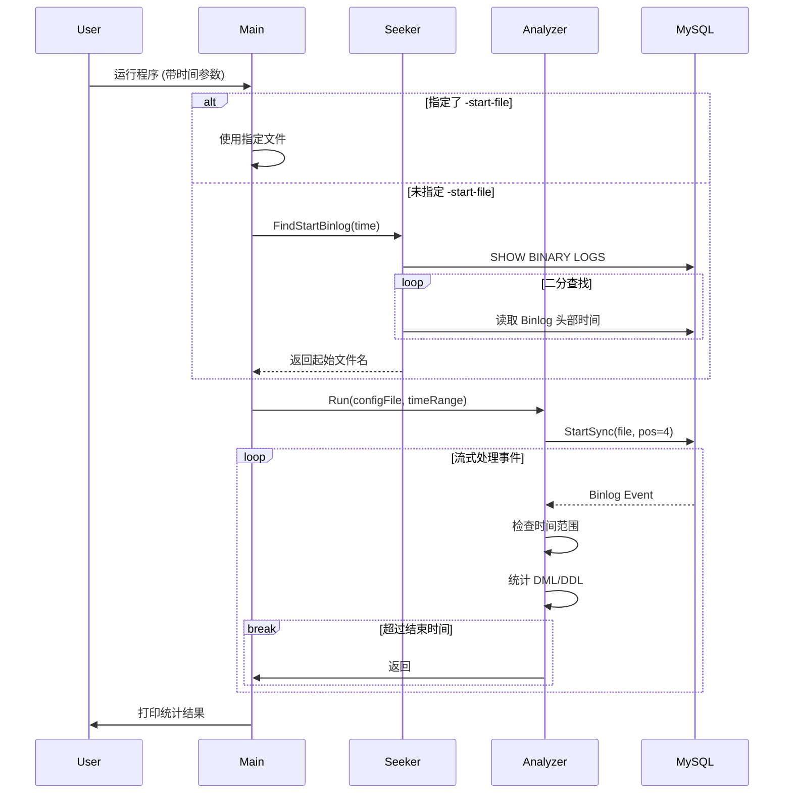

# 程序结构说明文档

本文档详细介绍了 Binlog 分析工具的代码结构、模块划分以及核心逻辑流程。

## 1. 目录结构

```
bin2sql/
├── cmd/
│   └── binlog-analyzer/
│       └── main.go         # 程序入口，负责参数解析和流程编排
├── go.mod                  # Go 模块定义
├── go.sum                  # Go 依赖校验
├── README.md               # 项目使用说明
├── docs/                   # 文档目录
│   └── ARCHITECTURE.md     # 本架构说明文档
└── pkg/                    # 核心代码包
    ├── seeker/             # 负责定位起始 Binlog 文件
    │   └── seeker.go
    └── analyzer/           # 负责 Binlog 事件分析和统计
        └── analyzer.go
```

## 2. 模块说明

### 2.1 主程序 (cmd/binlog-analyzer/main.go)

- **职责**：
    1. 解析命令行参数（Host, Port, User, Password, StartTime, EndTime, StartFile 等）。
    2. 校验时间格式。
    3. 如果未指定 `-start-file`，调用 `seeker` 模块查找起始文件。
    4. 初始化并运行 `analyzer` 模块。
    5. 打印最终统计结果。

### 2.2 查找器 (pkg/seeker/seeker.go)

- **职责**：在不知道具体 Binlog 文件名的情况下，根据给定的时间点找到对应的 Binlog 文件。
- **核心逻辑 (`FindStartBinlog`)**：
    1. 连接 MySQL 执行 `SHOW BINARY LOGS` 获取所有日志文件列表。
    2. 使用**二分查找算法**高效定位目标文件。
    3. 对每个被检查的文件，创建一个临时的 Binlog Syncer 读取其头部（FormatDescriptionEvent 之后）的第一个事件的时间戳。
    4. 比较文件起始时间与目标时间，缩小搜索范围。

### 2.3 分析器 (pkg/analyzer/analyzer.go)

- **职责**：流式读取 Binlog，过滤时间段，统计 DML/DDL 操作。
- **核心结构 (`Analyzer`)**：
    - 维护一个内存映射 `stats`：`Schema -> Table -> TableStats`，用于记录每个表的 Insert/Update/Delete/DDL 次数。
- **核心逻辑 (`Run`)**：
    1. 使用 `go-mysql` 的 `BinlogSyncer` 伪装成 Slave 连接到 Master。
    2. 从指定的 `StartFile` 开始流式读取事件。
    3. **事件处理循环**：
        - `RotateEvent`: 记录当前处理到的文件名。
        - `TableMapEvent`: 维护 TableID 到 `(Schema, Table)` 的映射关系。
        - `RowsEvent` (Write/Update/Delete):
            - 检查事件时间戳是否在 `[StartTime, EndTime]` 范围内。
            - 根据 TableID 找到表名，更新统计计数。
        - `QueryEvent`:
            - 解析 SQL 语句，判断是否为 DDL（CREATE, ALTER, DROP 等）。
            - 使用正则表达式提取表名，更新 DDL 统计计数。
    4. 当事件时间戳超过 `EndTime` 时，停止分析。

## 3. 关键流程图



## 4. 注意事项

- **内存使用**：程序采用流式处理，不会将整个 Binlog 文件加载到内存，因此内存占用主要取决于活跃的表数量（用于存储统计信息）。
- **DDL 解析**：目前的 DDL 解析基于简单的正则表达式，对于极其复杂的 SQL 语句（如包含注释、特殊字符）可能存在提取偏差，但在常规运维场景下足够准确。
- **权限要求**：
    - `REPLICATION SLAVE`: 用于同步 Binlog。
    - `REPLICATION CLIENT`: 用于执行 `SHOW BINARY LOGS`。
